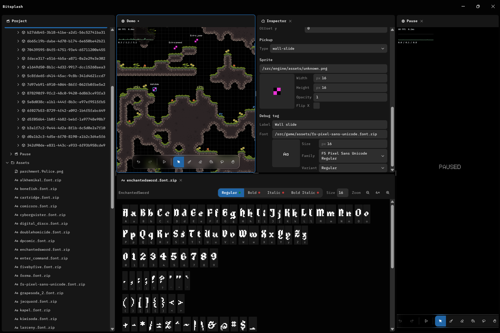

<div align="center">

# Bitsplash



_A hand-rolled 2D game engine, its editor, and a browser platformer built on top — all in one repo._

</div>

## Running locally

Bitsplash uses **[Bun](https://bun.sh)** (not npm/node). The editor runs in an **Electron** desktop shell and is developed on Windows.

```sh
bun install
bun run dev      # launches the editor in a desktop window
```

The game itself is a standalone web build — `bun run build`, then `bun run preview` to serve it in a browser.

## Philosophy

Bitsplash is **code-first and hand-rolled**: no game-engine framework, a custom entity-component-system, and the [planck](https://github.com/piqnt/planck.js) (Box2D) physics engine, drawn to an HTML canvas via WebGL2. The codebase is split into three strict layers — a reusable **engine**, an **editor** that authors content on top of it, and the **game** itself — and dependencies only ever point inward; the editor and game must never leak into the engine.

The bias throughout is toward small, composable, **data-driven** systems (JSON scenes, data-file prefabs, metadata-in-assets), behaviour living in **systems rather than object hierarchies** (there is deliberately no scene graph — entities relate by id), and **footgun-free APIs** whose safe, fast path is the default. Everything is meant to be observable and editable from the tooling. The game ships to any modern browser; the editor is a desktop app so it can own the filesystem and reclaim browser-reserved shortcuts.

---

## Table of Contents

<details>
<summary>Click to toggle</summary>

- [Bitsplash](#bitsplash)
  - [Running locally](#running-locally)
  - [Philosophy](#philosophy)
  - [Table of Contents](#table-of-contents)
  - [Project Progress](#project-progress)
  - [Architectural Principles](#architectural-principles)
    - [Dependency Rules](#dependency-rules)
      - [Engine](#engine)
      - [Editor](#editor)
      - [Game](#game)
    - [Design Goals](#design-goals)
    - [Status Legend](#status-legend)
  - [Roadmap: Major Systems](#roadmap-major-systems)
    - [Build order](#build-order)
    - [Cross-cutting seams (touched by multiple systems — design once)](#cross-cutting-seams-touched-by-multiple-systems--design-once)
    - [Parked / research (deliberately not designed yet)](#parked--research-deliberately-not-designed-yet)
  - [Engine](#engine-1)
    - [Core Architecture](#core-architecture)
      - [ECS](#ecs)
      - [Data Model](#data-model)
    - [Prefabs \& Composition](#prefabs--composition)
    - [Scene System](#scene-system)
      - [Model](#model)
      - [Transitions \& lifecycle](#transitions--lifecycle)
      - [Persistence](#persistence)
      - [In-game UI as scenes](#in-game-ui-as-scenes)
      - [Editor integration](#editor-integration)
    - [Save System](#save-system)
    - [Input System](#input-system)
    - [Physics](#physics)
    - [Events](#events)
    - [State Machines](#state-machines)
    - [Time System](#time-system)
    - [Asset \& Loading](#asset--loading)
    - [Rendering](#rendering)
      - [Cameras](#cameras)
      - [Screen-space UI](#screen-space-ui)
      - [Camera Composition](#camera-composition)
    - [Local Multiplayer](#local-multiplayer)
    - [Animation](#animation)
    - [Audio System](#audio-system)
      - [Design Goals](#design-goals-1)
    - [Environmental Simulation System](#environmental-simulation-system)
      - [Weather \& Wind](#weather--wind)
        - [Wind Integration (reactive system)](#wind-integration-reactive-system)
    - [Particles](#particles)
    - [Lighting](#lighting)
    - [Procedural Generation](#procedural-generation)
      - [Trees](#trees)
        - [Simulation](#simulation)
        - [Editor Support](#editor-support)
    - [Narrative Presentation System](#narrative-presentation-system)
      - [Cutscenes](#cutscenes)
      - [Rich Text System](#rich-text-system)
      - [Integration Targets](#integration-targets)
    - [AI \& Navigation](#ai--navigation)
    - [Social Simulation System](#social-simulation-system)
    - [Item System](#item-system)
    - [Tile \& Sprite Atlas System (PNG Metadata Driven)](#tile--sprite-atlas-system-png-metadata-driven)
      - [Core Concept](#core-concept)
      - [Supported Metadata (examples)](#supported-metadata-examples)
      - [Features](#features)
      - [Sprite Editor Extensions](#sprite-editor-extensions)
      - [Design Notes](#design-notes)
    - [Debugging \& Tools (Engine Support)](#debugging--tools-engine-support)
    - [Profiling](#profiling)
    - [Fonts](#fonts)
    - [Networking \& Modding](#networking--modding)
      - [Networking](#networking)
  - [Editor](#editor-1)
    - [Desktop shell (Electron)](#desktop-shell-electron)
    - [Workspace: Docking \& Panels](#workspace-docking--panels)
  - [Editor Style Guide](#editor-style-guide)
    - [Regions \& depth](#regions--depth)
    - [Overlays \& dialogs](#overlays--dialogs)
    - [Shape](#shape)
    - [Color](#color)
    - [Spacing \& type tokens](#spacing--type-tokens)
    - [Interactivity (mandatory for every interactive element)](#interactivity-mandatory-for-every-interactive-element)
    - [Accessibility](#accessibility)
    - [Copywriting](#copywriting)
    - [Motion](#motion)
    - [Styling mechanics](#styling-mechanics)
    - [Components](#components)
    - [Exemplars already in the tree (copy these)](#exemplars-already-in-the-tree-copy-these)

</details>

---

## Project Progress

This is a living document. Mark anything you've worked on as done/not planned (strikethrough)/in-progress when you touch it.

> A custom 2D game engine, editor, and platformer game built on top of it.
>
> The project is intentionally separated into three layers:
>
> - **Engine** — reusable technology that supports a broad class of 2D games (currently focused on platformer-style systems).
> - **Editor** — tooling for creating, editing, and debugging content built on the engine.
> - **Game** — the specific platformer implementation built using engine systems.
>
> The engine is generic in design, but intentionally shaped around 2D platformer gameplay needs (Camera2D, physics worlds with gravity, tile systems, etc.).
> The editor and game are strict consumers of the engine and must not leak into it.

---

## Architectural Principles

### Dependency Rules

Engine ← Editor
Engine ← Game

#### Engine

The engine must remain completely independent of project-specific code.

Allowed:

- Engine modules
- Third-party libraries
- Browser / platform APIs

Forbidden:

- Editor code
- Game code

#### Editor

Allowed:

- Engine modules
- Editor modules
- Third-party libraries

Forbidden:

- Game code

#### Game

Allowed:

- Engine modules
- Game modules
- Third-party libraries

Forbidden:

- Editor code

---

### Design Goals

- Maintain low coupling between layers
- Keep engine reusable outside this project
- Keep systems data-driven wherever possible
- Prefer declarative content formats (JSON / Markdown / metadata-in-assets)
- Enable strong ECS-driven simulation + event-driven gameplay
- Ensure everything is observable and debug-friendly from editor tooling
- **No entity hierarchy, ever** — no parent/child, no scene-graph tree. Entities
  relate by id-references in components; all behaviour lives in systems.
  Multi-entity constructs are spawned and wired by id by a system, not a tree.

---

### Status Legend

- [x] Completed
- 🚧 In Progress
- 💡 Planned
- 🔬 Research / Prototype
- ⚠️ Needs Redesign

---

## Roadmap: Major Systems

Nine large systems are designed but not yet built. Each has a roadmap section
below and a detailed architectural plan under `docs/plans/`.

| System                | Plan                            | Depends on                     |
| --------------------- | ------------------------------- | ------------------------------ |
| Generic State Machine | `docs/plans/state-machine.md`   | —                              |
| Prefabs & Composition | `docs/plans/prefabs.md`         | —                              |
| Scene System          | `docs/plans/scenes.md`          | Prefabs (instance format)      |
| Save System           | `docs/plans/save.md`            | Scene, Prefabs                 |
| Asset Lifecycle       | `docs/plans/asset-lifecycle.md` | Scene, Prefabs, renderer evict |
| Editor Docking        | `docs/plans/editor-docking.md`  | Scene (multi-viewport only)    |
| Animation             | `docs/plans/animation.md`       | State Machine                  |
| AI & Navigation       | `docs/plans/ai-navigation.md`   | State Machine, Scene           |
| Sprite Editor Ext.    | `docs/plans/sprite-editor.md`   | Animation (authoring only)     |
| Profiling             | `docs/plans/profiling.md`       | Asset budget (memory only)     |

### Build order

**Foundations first** (unblock the rest):

1. ~~**Generic State Machine**~~ — done. Unblocks Animation + AI.
2. **Prefabs** (instance = `{prefab, overrides}`) — fixes the scene/save entity
   format before anything serializes it.
3. ~~**Scene System** — the keystone. Removes the `Game.world` singleton~~ — core
   done (Scene-owns-World, SceneManager + additive stack, context split, per-scene
   texture compositor, multi-viewport `scene:<id>` editor views + project tree +
   per-scene play, `*.scene.json` format). Transitions, persistent scene, in-game-UI-
   as-scenes, and a scene-management/create panel still pending.

**Then** (depend on the above): Save → Asset Lifecycle → AI; Animation (after the
State Machine).

**Parallel "anytime" tracks** (no hard deps, good early wins): Editor Docking
steps 1–4 (the layout/tabs/drag, before multi-viewport); Profiling; the Sprite
Editor selection → toolset → palettes (animation authoring waits on Animation).

### Cross-cutting seams (touched by multiple systems — design once)

- ~~**Kill the `Game.world` singleton** (Scene) — the first big refactor; the
  context split (global services vs per-scene ecs/world/events) underlies the
  whole frame loop.~~ — done.
- **`PlayerInput` → intent + actuation refactor** (AI unified intent) — player and
  AI write the same intent components.
- **Renderer changes** — a GPU-texture `evict(image)` API (Asset unload) and
  multi-target/multi-context output (editor multi-viewport; runtime split-screen
  already exists).
- **One serialization format with versioned migration** spanning scene content,
  saves, and prefab instances — the `version` field is the shared migration seam;
  owns the dangling-override-key validation.
- **Spritesheet/atlas PNG iTXt metadata** — shared by tiles, animation frames, and
  the sprite editor; finalize the format once.
- ~~**Global vs per-scene event bus** — cross-scene/transition events on a global
  bus, gameplay events on each scene's `world.events`.~~ — split in place
  (`Game.events` global; each scene's `world.events` for gameplay). The global bus
  has no consumers yet (transitions pending).
- **Fullscreen wrapper + debug-overlay portal** (Profiling) — also the enabler for
  the AI debugger and any other in-playtest debug chrome.

### Parked / research (deliberately not designed yet)

- **Animation blending** — for pixel-art frames, cross-fade + parametric clip
  _selection_ (not interpolation); true interpolation belongs to skeletal.
- **Skeletal workflow** — screen-space rig → posed pixels + attachment points;
  rules undefined; likely a runtime model + editor authoring (not editor-only).
- **Behavior trees / Utility AI** — additional decision policies on the AI
  substrate; utility AI is the expected fit for Social Simulation.

---

## Engine

> The engine provides reusable systems for 2D games. It is designed around ECS-driven simulation, deterministic data flow, and deep editor integration. While generic, it is intentionally optimized for platformer-style gameplay.

---

### Core Architecture

#### ECS

- [x] Entity Component System
- [x] Component registration via decorators
- [x] Efficient component queries (by constructor/type)
- [x] Runtime component discovery
- [x] Automatic serialization / deserialization
- [x] Data-driven component definitions
- [x] Entity lifecycle: blessed `World.despawn` (tears down the physics body, no leak), data-file prefabs (`src/game/prefabs/*.json`) + spawn points, and death → delayed respawn

#### Data Model

- [x] Serializable component framework
- [x] Field decorators for extended types
- [x] Strongly typed component fields (custom primitives)
- [x] Generic `TagsComponent` (engine; semantic entity roles as a JSON-safe `string[]` + `has(tag)`) — systems filter on roles ("enemy", "patrol") rather than on behaviour/AI components, mirroring Unity GameplayTags / Bevy marker components / Godot groups
- [x] Custom value-type (de)serialization registry (`serialization/value-type-registry.ts`)
      — value types opt in with the `@valueType()` class decorator and are encoded/decoded
      by `$type` through the registry (no inline `instanceof` special-casing). `Vector2`,
      `Angle`, `FontSettings`, and `FadeTimeline` are registered this way. Engine-internal,
      so import polarity is unaffected.
- [x] Transient runtime components are deliberately **not** `@serializable` — overlay/notice
      state spawned by systems during play (`DeathNoticeComponent`, `QuestNoticeComponent`,
      the runtime `DialogueComponent`) is never authored content, so it stays out of level/save
      data per "save = authored initial state only." Omitting `@serializable` is the deliberate
      marker, not an oversight.

---

### Prefabs & Composition

> Authored, reusable entity templates. A prefab is a single-entity, serialized
> component template; scenes instance prefabs by reference + overrides. Promoted
> from a game-only helper into an engine capability (scenes instance templates).
>
> Full architectural plan: `docs/plans/prefabs.md`.

- 💡 **Prefab = data template** (the core concept) — a serialized single-entity
  component set, promoted into the **engine** (registry + resolution +
  instantiation); the game still ships the JSON files. (Replaces today's
  game-only `game/prefabs.ts`.)
- 💡 **Single-inheritance variants** — a prefab may `extends` one base prefab and
  override/add component fields (flecs `IsA` / Unity-variant style); resolved by
  field-level merge at load. Enables `fast_enemy extends enemy`.
- 💡 **Instances = prefab ref + overrides** — a placed instance stores
  `{ prefab, overrides: { only-changed fields } }`, not a baked copy. Scene/level
  files stay small and prefab edits propagate to un-overridden fields. This is
  the scene-content entity format (see Scene System).
- 💡 **Bundles = optional code sugar** — a thin helper for composing component
  groups in code-side factories (Bevy-bundle-style). Sugar for the code path, not
  a parallel authoring system; independent of data prefabs.
- 💡 **Editor prefab authoring** — create an entity → "save as prefab"; edit a
  placed instance → fields that differ are tracked as overrides, with
  "revert to prefab" per field.
- 💡 Single-entity only — per the no-hierarchy rule, multi-entity groups are a
  spawner-system concern (instantiate several prefabs, wire them by id), not a
  prefab sub-tree.

---

### Scene System

> Scenes partition the game into independently-simulated worlds (levels, house
> interiors, the main menu). Each scene owns its own `World`; a `SceneManager`
> runs an additive stack of active scenes. The editor opens and edits scenes the
> way it currently edits the single demo world.
>
> Full architectural plan: `docs/plans/scenes.md`.

#### Model

- [x] **Scene = own World** — each scene owns its own ECS + physics world + event
      bus (+ optional tilemap). Full isolation; killed the single `Game.world`
      singleton (`Game` now owns a `SceneManager`; the update/render context is split
      into global services vs per-scene `ecs`/`world`/`events`, gameplay events on
      each scene's `world.events`). Clean unload (`World.clear`) exists; the
      transition-driven unload flow is still pending (below).
- [x] **Code factory + content data** — a scene _kind_ is a TS factory
      (`registerScene(kind, factory)`) that builds the World (from `config.gravity`),
      tilemap, and system set (`FantasyPlatformer` collapsed into the `platformer`
      factory). Authored _content_ is a serialized `*.scene.json`
      (`{ version, kind, config, tiles, entities }`, config is the source of truth)
      loaded by engine `createScene`. Entities stay in the bare serialized form;
      prefab-instance entities + save migration are deferred to Prefabs/Save.
- [x] **Additive stack** — the `SceneManager` runs a stack of
      simultaneously-active scenes; each entry carries explicit flags `update`,
      `render`, `blocksUpdateBelow`, `blocksInputBelow`. Update walks top→bottom
      (stops at `blocksUpdateBelow`), render bottom→top, with a single screen-space
      UI overlay pass. (`blocksInputBelow` is modeled + queryable via
      `receivesInput`, but not yet enforced on the global `Input` — frozen scenes
      simply aren't updated.)
- [x] **Per-scene texture compositor** — each active scene renders its full
      screen-space image (camera world pass + its own UI pass at the scene's
      `uiScale`) into its **own** `RenderTarget`; the stack is composited bottom→top
      to the viewport in one `Renderer2D.composite` pass. Replaces the old
      last-camera-wins `present` + single shared screen-space UI overlay. The renderer
      is no longer a `GlobalService` — it's passed per render call, so a scene can
      render to any viewport's renderer (multi-viewport). The playtest pause is now a
      real composited transparent overlay scene (no giant-rect hack).
- [x] **Per-scene play/edit lifecycle** — the snapshot → simulate → restore +
      spawn-runtime-on-play flow moved out of `FantasyPlatformer` onto `Scene`
      (engine), driven for the editor's focused scene.

#### Transitions & lifecycle

- 💡 Event-driven transitions (`LoadScene` / `PushScene` / `PopScene` /
  `ReplaceScene` on a global bus), with async asset preload and an optional
  transition (fade) hook before the swap.
- 💡 Scene unload tears down the scene's physics bodies + ECS (reuses
  `World.clear`) and releases its asset references (→ Asset & Loading).

#### Persistence

- 💡 **Persistent scene** — a special always-active scene (never unloaded on
  transition) holding **non-physical, cross-scene state** (save / inventory /
  managers / audio). Physical entities (the player) are per-scene content,
  spawned into each gameplay scene and restored from persistent state — no
  physics-body migration.

#### In-game UI as scenes

- 💡 Menus / HUD render as **canvas (screen-space WebGL) entities within a
  scene's world** — React DOM is editor-only. A main-menu scene is a World of UI
  entities; this matures the existing screen-space UI pass.
- 💡 **Goal: all in-game UI becomes its own stacked scene** (composited on top by
  the per-scene texture compositor) — not UI-layer render systems living inside the
  gameplay scene as today (health bars, dialogue panel, quest/objective HUD, death
  overlay, interact hints). Each UI render system would be relocated to where it
  belongs (a UI scene). **Parked** pending the cross-world data-access model: unlike
  Unity/Godot/Unreal (which don't isolate scenes into separate worlds, so a HUD
  reading game state is free and UI placement is case-by-case there), bitsplash's
  "Scene = isolated World" means a UI scene must explicitly read the gameplay
  world's ECS. Decide that model (persistent scene / explicit source-scene
  reference / relaxed cross-scene queries) before splitting the HUD out. Pure menus
  (main/pause) are uncoupled and can become scenes first.

#### Editor integration

- [x] **Editor operates on the focused scene view** — the project is a set of
      lazily-instantiated scenes (`editor/project.ts`, backed by `sceneSummaries()` +
      `createScene(id)`). The editor systems target the **focused** scene view's scene
      (`editor/scene-view.ts` binds camera/tile/entity/preview/highlight/grid + a
      per-view `History` + per-view `Input` to one scene). Entity ids are globally
      unique, so selection/hover read against the focused scene unambiguously.
- [x] **Project tree** (`editor/project-tree.tsx`, renamed from `entity-tree`) —
      lists **Game → Scene(s) → World → Entity → Component** + an Assets sibling.
      Scene rows open/focus a `scene:<id>` view; expanding a scene lazily instantiates
      its world to list entities.
- [x] **Multiple scenes open at once, each in its own viewport** (side-by-side) —
      each `scene:<id>` view owns its own canvas + WebGL context + `Renderer2D`
      (`editor/scene-view-panel.tsx`); one editor loop renders every open scene view to
      its own renderer, updating editor systems only for the focused view.
- [x] **Per-scene play/edit controls** — each scene view's floating toolbar plays
      **that** scene: it becomes the `SceneManager` base, simulates, and the editor
      **unmounts**, mounting only a fullscreen play surface (the engine `Game`'s
      viewport). Exit restores the scene + remounts the editor. Session-only default
      scene (no disk write).
- 💡 Scene management panel (create / delete / rename project scenes, persist the
  start scene to a project config) — listing / open / close exist via the tree +
  tabs; creation and a persisted start scene are still pending.

---

### Save System

> Runtime progress persistence, layered **on top of** serialization (it consumes
> it, doesn't replace it). Distinct from the editor's authored scene-content save:
> serialization is the low-level entity↔JSON codec; **scene content** is the
> authored baseline saved by the editor; a **save** is a versioned, runtime
> snapshot of game progress written to a file.
>
> Full architectural plan: `docs/plans/save.md`.

- 💡 **Full world-state snapshots** — a save captures the complete runtime/entity
  state of every loaded scene + the active scene stack + the persistent scene
  (progress/inventory). One uniform format; load restores exact state (no
  baseline reload). Authored tiles are referenced by scene-content id+version,
  not duplicated, unless mutated at runtime.
- 💡 **File-based storage** — saves are files via the File System Access API
  (Chrome): a chosen save folder is the slot directory, files are slots,
  persistent handles allow overwrite. Download/upload is the portable fallback.
  (localStorage stays reserved for small editor prefs.)
- 💡 **Versioned migration** — a `version` field + a linear migration registry
  (N→N+1). **Best-effort + report**: migrate what's possible, drop unknown
  components / dangling prefab-override keys, load the rest, and surface what was
  dropped. Shares the prefab override-key validation.
- 💡 **Checkpoint framework** — game-layer `Checkpoint` component + trigger system
  that fires a full save to a slot when reached. No separate lightweight format —
  a checkpoint is just an automatic save trigger.
- 💡 **Auto-save** — game-layer system saving to a dedicated slot on a timer or on
  events. Built on the same engine save API.
- 💡 **Engine vs game split** — engine provides the `SaveManager`
  (capture/restore world+stack ↔ blob), migration registry, and file backend;
  the game provides checkpoint/auto-save systems and the in-game slot UI (canvas,
  per the UI principle).

---

### Input System

> Platform-agnostic input abstraction supporting keyboard, mouse, and gamepads.

- [x] Action-based input mapping layer
- 🚧 Configurable key bindings (single remappable action map for movement + interact; in-game config UI pending)
- [x] Keyboard + mouse support
- [x] Gamepad support (multi-device)
- 🚧 Touch + gesture support

---

### Physics

> 2D physics world designed for platformer-style gameplay.

- [x] 2D physics system
- 💡 Physics world configuration (gravity, scale, rulesets)
- 💡 Multiple physics worlds support
- 💡 Debug visualization tools

---

### Events

> Core engine-level event bus used by all systems.

- [x] Generic event system
- 💡 Event filtering / querying
- 💡 Event history (debug + replay support)
- 💡 Serialized event streams

---

### State Machines

> A **generic** engine FSM primitive, reused across AI decision policy, sprite
> **animation** state machines, player movement states, and narrative. Data-only:
> no callbacks — states/transitions are data, reactions are systems.
>
> Full architectural plan: `docs/plans/state-machine.md`.

- [x] **Generic FSM core** — `StateMachineComponent` (current state, elapsed,
      params/blackboard) + a `FsmDef` (states + prioritized transitions +
      any-state transitions); a `StateMachineSystem` ticks it and emits
      `StateEnterEvent`/`StateExitEvent`. No callbacks on the FSM.
- [x] **`@fsm(id)` decorator** — registers a def class by id at import time,
      mirroring the `@serializable` pattern. Game defs live under `game/fsm/` and
      are loaded via `import.meta.glob`.
- [x] **Pluggable condition evaluator** — transitions evaluate via either **code
      predicates** over a blackboard (code-first AI) or **data-driven parameter
      conditions** (`speed > 0.1`, `trigger:attack`; Unity-Animator-style, authorable
      in the sprite editor for animation). Same core, two condition sources.
      `elapsed` is injected into params as a reserved key before evaluation.
- [x] **`PatrolDef`** — first code-condition consumer; `PatrolSystem` migrated to
      read direction from FSM state.
- 💡 Migrate player movement onto FSM.
- 💡 AI decision policy (Idle/Patrol/Chase/Attack/Flee) built on FSM.
- 💡 Data-condition evaluator wired into animation consumer.
- 💡 Editor authoring of data-condition defs (animation graph in sprite editor).

---

### Time System

> Global simulation clock used by all systems.

- 🚧 Global time system (engine `Clock`; supplies elapsed/dt/scale to all update + render systems)
- 🚧 Time scaling (pause, slow motion, cutscenes) (`scale` field present; stub)
- 💡 Frame-independent simulation support
- [x] Scheduled events (generic `TimerComponent` + `scheduleEvent`; emits a stored event after a delay — used by respawn)

---

### Asset & Loading

> Asset lifecycle is an **in-game / runtime concern**. The editor is React-land
> and gets **no lifecycle** — it loads sprites/sounds to display & edit via plain
> React loading (promises / `` / object URLs), reclaimed by GC + the browser
> cache, and never touches `AssetManager`. Same files on disk, deliberately
> separate loading paths by consumer.
>
> Full architectural plan: `docs/plans/asset-lifecycle.md`.

- 🚧 Asset manager (in-game: cache + immediate-mode getters; lifecycle below is
  planned on top)
- 💡 **Reachability-based keep-set** — the resident set is the union of asset urls
  referenced by all loaded scenes' content **and their spawnable prefabs** (via
  `@file` fields) + explicit pins. Recomputed at scene load/unload. A spawnable's
  asset stays resident while its scene is loaded → no load/unload thrash.
- 💡 **Decoupled eviction** — unload never fires on "zero live instances." Non-keep
  assets are freed at **clear points** (scene unload) and under **budget LRU**
  pressure. Unload frees downstream GPU textures (renderer texture cache) + audio
  buffers via the asset's teardown.
- 💡 **Memory budget tracking** — per-asset `sizeOf`, a tracked total, and an LRU
  cap that evicts zero-reach assets early. Feeds the memory profiler.
- 💡 **Promise-based preload** — `preload(urls): Promise<void>` alongside the
  immediate-mode getters, so scene transitions can await assets before swapping.
- 💡 **In-game audio buffers** flow through the asset manager (one budget/lifecycle
  for sounds too); realtime playback stays in `AudioManager`.
- 💡 **In-editor asset debugger** — panel listing loaded assets (url, type, status,
  size, reachable-by, last-used) with force-unload/reload + hot-reload on file
  change.
- 💡 Streamable assets / chunked world streaming / background loading jobs
  (later; build on preload + the keep-set).
- 💡 WeakRef/FinalizationRegistry only as a secondary signal / editor-side reclaim
  — never the primary in-game mechanism (non-deterministic, can't honor a budget).

---

### Rendering

#### Cameras

- [x] Camera2D system
- [x] Multi-camera support (local multiplayer ready)
- [x] Camera shake (trauma-based transient render offset; decoupled from the follow system, driven by `CameraShakeComponent`)

#### Screen-space UI

- 🚧 Screen-space WebGL UI pass (fixed "global" UI zoom independent of camera zoom; renders UI layers over the world). Quick-and-dirty seam — a proper solution (dedicated UI camera, responsive scale, settings) is still needed.

#### Camera Composition

- 💡 Split-screen compositor
- 💡 Dynamic camera merging
- 💡 Heuristic-based camera grouping

---

### Local Multiplayer

- [x] Multiple input sources supported
- [] Split-screen rendering
- [] Multiple active Camera2D instances
- 🚧 Keyboard + gamepad combinations

---

### Animation

> Frame-based sprite animation driven by the generic **State Machine**. v1 is
> **clips only** (hard-cut transitions); blending is parked as a concept (see
> below). Authoring tools (timeline/onion-skin/graph) live in the sprite editor.
>
> Full architectural plan: `docs/plans/animation.md`.

- 🚧 Generic eased **`Tween`** primitive (engine/animation; `from`→`to` over a duration with a named easing curve, incl. `easeOutBack` overshoot; `tick()`/`value()`/`progress()`/`done()`/`retarget()`) + a shared `easing` module — the first consumer-agnostic animation primitive, powering the dialogue slide-in/out. Frame-clip authoring (below) will reuse the same easing/sampling substrate.
- 🚧 `FadeTimeline` value type (engine/animation; fade-in/hold/fade-out with `tick()`/`alpha()`/`done()`) — a deliberate stopgap powering the death + quest notice overlays; now routes its ramps through the shared `easing` module; to be folded into a timeline clip once the animation system lands
- 💡 **Spritesheet clips** — a clip = ordered frame rects (in a metadata-tagged
  spritesheet PNG) + per-frame durations + loop flag. `SpriteComponent` gains an
  optional source-rect the animator drives; the renderer samples it (tiles already
  sample sub-rects).
- 💡 **Animator** — `AnimatorComponent` (current clip/state, frame, elapsed, speed,
  playing); `AnimationSystem` advances frames and writes the sprite's source rect.
- 💡 **Animation graph = the generic FSM** — states map to clips; data-driven param
  conditions (`speed > 0.1`, `trigger:attack`) drive transitions; `StateEnterEvent`
  switches the playing clip. Hard cuts in v1.
- 💡 **Animation events** — frame-tagged events emitted on the bus (footstep,
  spawn-hitbox, fire), consumed by gameplay systems.
- 🔬 **Blending (conceptual, not built)** — for pixel-art frame animation,
  "blending" = cross-fade transitions + blend trees that _select_ a clip by param
  (no pixel interpolation). True interpolation belongs to a future **skeletal**
  track. Parked deliberately — may find use in some 2D effects or once skeletal
  exists.
- 💡 Preview / onion-skin / graph authoring → **sprite editor**.
- 💡 Attachment points (named per-frame anchors) → deferred to the **skeletal
  workflow** (sprite editor).

---

### Audio System

> Fully data-driven audio system supporting SFX, music, and layered reactive music.

- 🚧 Sound effects (SFX) playback system (Web Audio loading + playback; realtime granular pitch/time shifter for independent pitch & speed)
- 🚧 Generic `AudioBuffer` playback API (offset / position / stop handle) reused by editor tooling
- 🚧 In-editor audio editor (clip-based multi-track timeline; non-destructive clips over a shared buffer; razor=split, drag-to-move with silence-fill, edge-trim; undo/redo; mic recording; arrangement-rendered WAV export) on a reusable generic clip `Timeline` (CSS-grid, named height-adjustable tracks; substrate for the future sprite-animation editor + planned timeline-based cutscenes)
- 💡 Music playback system
- 💡 Layered music system (stems: percussion / melody / harmony / etc.)
- 💡 Reactive music states (exploration, combat, danger, calm)
- 💡 Dynamic mixing system (adaptive volume balancing)
- 🚧 Event-driven audio triggers (via engine event bus) (dialogue emits per-glyph CharacterRevealedEvent → VoiceSystem plays a pitched blip)
- 💡 Audio parameter system (threat level, intensity, distance, etc.)

#### Design Goals

- Fully data-driven audio definitions
- Music reacts to game state rather than explicit scripting
- Supports layering / intensity scaling instead of track swapping
- Allows crossfading and smooth transitions between states

---

### Environmental Simulation System

> Global systems influencing physics, rendering, AI, and gameplay.

#### Weather & Wind

- 💡 Global weather states and transitions
- 💡 Wind simulation (direction + strength fields)
- 💡 Spatial wind maps
- 💡 Wind debug visualization

##### Wind Integration (reactive system)

- 💡 Particle interaction
- 💡 Vegetation interaction
- 💡 Decoration interaction
- 💡 Procedural tree interaction
- 💡 Gameplay interaction hooks

> Weather is a high-level simulation layer. It does not directly control rendering systems but influences other systems through data.

---

### Particles

- 💡 Particle system
- 💡 Emitters
- 💡 Editor controls
- 💡 Wind-reactive particles

---

### Lighting

> Independent rendering system (not tied to weather directly).

- 💡 Grid-aware lighting
- 💡 Dynamic lights
- 💡 Ambient lighting
- 💡 Debug visualization tools

---

### Procedural Generation

#### Trees

- 💡 Algorithm-driven generation
- 💡 Sprite-driven generation
- 💡 Palette-driven generation
- 💡 Pixel-art focused output

##### Simulation

- 💡 Wind-reactive branches
- 💡 Wind-reactive leaves
- 💡 Seasonal variation support

##### Editor Support

- 💡 Live preview generation
- 💡 Parameter tweaking tools
- 💡 Algorithm inspection UI
- 💡 Wind simulation preview

---

### Narrative Presentation System

> Unified system for cutscenes, dialogue, and rich text rendering.

#### Cutscenes

- 💡 Timeline-based cutscenes
- 💡 Camera tracks
- 💡 Animation tracks
- 💡 Event tracks

#### Rich Text System

- [x] Markdown-inspired custom rich text format (HTML-style tags: `<b>`, `<i>`, `<color=#hex>`, `<wave force= speed=>`; `<a>` link tag parsed but not yet wired to game systems; `<b>`/`<i>` select a native weight/italic face when the family provides one — see Fonts below — and fall back to synthesized dilate/shear otherwise)
- 🚧 Animated text effects (typewriter reveal with comma/full-stop pacing scaled to chars-per-second)
- 🚧 Embedded event triggers (link `<a>` tag parsed/carried; activation pending. Generic interaction events wired: `InteractEvent` → dialogue / `DamageEvent`, e.g. the damage trap that strikes on dialogue dismissal)
- [x] Per-character animation support (one-char-at-a-time reveal with pre-computed reflow so lines don't jump; per-span jiggle with configurable force + speed)

#### Integration Targets

- 🚧 Dialogue (proximity interaction → camera framing → revealing text panel. Interaction is generic: `InteractionSystem` emits `InteractEvent`; a `DialogueSourceComponent` (referencing an Ink **knot**) + trigger system opens the dialogue — no signpost coupling. **Branching narrative runs on [inkjs](https://github.com/y-lohse/inkjs)** (the Ink runtime): one global `Story` compiled in-browser at runtime via inkjs's `Compiler` from `game/ink/*.ink` (a master file `INCLUDE`s per-conversation scene files), held on a runtime `InkStoryComponent` (live `Story` not serialized + `state.ToJson()` serialized, mirroring the FSM component). The dialogue system steps `Continue()`/`currentChoices`/`ChooseChoiceIndex`; Ink **variables** + auto **visit-counts** replace the old hand-rolled blackboard/conditions/effects. Game actions are Ink `EXTERNAL` functions bound to bus events (`start_quest`/`advance_quest`/`decline_quest`/`give_item`); side-effects fire at the authored beat (e.g. on the confirm choice). Reused presentation layer: rich-text (`<b>`/`<color=hex>`/`<wave>`, passed through Ink untouched — color drops the `#` since Ink reserves it for tags), sentence-aware interact-advanced pagination, keyboard option nav (nav + confirm). Per-conversation speaker font via Ink knot **tags** (`# font: doublehomicide`); options always render in the player font. **9-slice parchment panel** behind the box (replaces the black placeholder) via the generic `drawNineSlice` engine helper + insets read from the PNG's embedded metadata; the panel image is selectable **per dialogue target** via an Ink knot tag (`# panel: parchment`, mirroring `# font:`) → `game/ink/panels.ts`. The box **slides up from the bottom with an overshoot** on open (eased `Tween`) and **slides back down before closing** on dismiss; typewriter reveal waits until the box settles)
- 🚧 Signposts / world objects (generalized to a generic `Interactable` + `DialogueSource` archetype with a per-interactable `prompt`; the "Press <key> to <prompt>" hint works for any interactable)
- 🚧 Quests (data-driven JSON quests under `game/quests/*.json`; stage progression expressed as the generic FSM via a per-quest `@fsm` def + a `StateMachineComponent` on the quest entity, stage mirrored into a serializable `QuestComponent` **and an Ink variable** (`quest_<id>`) that dialogue gates on; `killTagged` objectives counted off a tags-snapshot `KillEvent`; extensible `RewardHandler` registry emitting `QuestRewardEvent`, inventory grant pending; dialogue drives start/advance via Ink `EXTERNAL` functions → bus events; quest-giver NPC prefab + Ink dialogue; top-right objective HUD + fading quest-notice overlay. First quest: "Massacre". Ink and the engine FSM stay orthogonal — Ink is the narrative VM, the FSM drives gameplay/quest progression)
- 💡 Books / journals
- 💡 Cutscenes
- 💡 System-driven narration

---

### AI & Navigation

> Generic AI infrastructure for a 2D platformer. Built on the principle that **AI
> produces the same _intent_ the player does** (perception → blackboard →
> decision policy → intent → existing actuation), and on a **platformer
> nav-graph** (walk/fall/jump links), not naive grid A\*.
>
> Full architectural plan: `docs/plans/ai-navigation.md`.

- 💡 **Pluggable-policy brain** — perception writes a blackboard; a decision policy
  reads it and emits intent. **FSM** (the generic State Machine) is the first
  policy; **behavior trees** and **utility AI** are additional policies on the
  same substrate (utility AI is the likely fit for Social Simulation below).
- 💡 **Unified intent actuation** — AI writes the same move/jump/aim/fire intent
  components the player input writes; movement/bow/etc. actuate both identically.
  Requires factoring `PlayerInputSystem` into intent + actuation.
- 💡 **Perception** — vision (planck raycast / cones), proximity queries, sound
  events → blackboard facts (target id, distance, line-of-sight, last-known pos).
- 💡 **Platformer nav-graph** (full commit) — walkable surface spans from the tile
  grid; **walk / fall / jump** links computed from a parametric jump arc, edges
  tagged with required capability and filtered per agent. A\* yields walk/jump/fall
  plans; a path-execution system turns plan edges into intent. Rebuilds on tile
  change; per-scene graph.
- 💡 **In-editor AI debugger** — canvas debug-draw (nav-graph, computed path,
  vision cones, current state) + a React inspector (blackboard, FSM state +
  transitions) usable in playtest via the profiler's debug-overlay.

---

### Social Simulation System

> Unified system for NPC memory, reputation, and interaction-driven state.
> Likely consumes **utility AI** as a decision policy on the AI substrate above.

- 💡 NPC memory (persistent knowledge of player actions)
- 💡 Reputation system (NPC + faction)
- 💡 Relationship tracking
- 💡 Dialogue condition evaluation
- 💡 Action-driven world awareness (crime, theft, combat, etc.)

---

### Item System

> Unified system for inventory, equipment, toolbar, and world items.

- 💡 Item definitions + metadata
- 🚧 Physics-based item instances (first weapon: a cursor-aimed **bow** that orbits the player and fires gravity-affected **arrow** projectiles; arrows raycast-stick on collision, deal damage via `DamageEvent` to anything with `Health`, ride the body they hit (so they lodge into and follow moving targets), then fade out on a lifetime, fall when their host is removed, or despawn past the world bounds. Targets: a static dummy and a `Patrol`-driven enemy that walks on intervals, takes damage, and respawns)
- 💡 Inventory containers
- 💡 Equipment slots
- 💡 Toolbar / hotbar system
- 💡 Item modifiers (stats, effects)
- 💡 Pickup / drop / world interaction system

---

### Tile & Sprite Atlas System (PNG Metadata Driven)

> Single-atlas system where tiles, decorations, caps, and multi-cell assets are defined inside PNGs using embedded metadata.

#### Core Concept

- PNG files contain both pixel data and structured metadata
- Metadata is stored using PNG text chunks (`iTXt` preferred)
- Sprite editor reads and writes metadata directly

#### Supported Metadata (examples)

```json
{
	"id": "grass_tile",
	"type": "tile",
	"collision": "solid",
	"windReactive": true,
	"multiCell": false,
	"animationFrames": [],
	"tags": ["terrain", "grass"]
}
```

#### Features

- 🚧 Sprite/tile editor (live 1:1 texture editing + baked autotiled game-view preview, pixel-perfect brush/erase strokes, OKLCH colour picker with alpha + eyedropper, pan/zoom, undo/redo, explicit save; PNG only)
- [x] Sprite vs tileset distinction (`*.tileset.png` → autotile editing + game-view preview; any other image → plain sprite, no game view)
- [x] Layer system (per-layer canvas with reorder, full Canvas blend-mode set, opacity, visibility, rename, thumbnails; composited via Canvas2D — preview and saved PNG share one flatten path; layers are not persisted in the file)
- [x] Bounded sprite canvas (checker confined to the image rect with a plain background outside; off-canvas clicks paint nothing; brush preview hidden off-canvas)
- [x] Unified vertical sprite toolbar (tools + colour + undo/redo + layers panel in one left column; slim top bar for filename + save)
- [x] Asset creation from the `/assets` context menu (New sprite / New tileset with a name + size dialog, New audio; grouped with dividers, available on the Assets folder and any child)
- 💡 Single atlas containing:
  - tiles
  - decorations
  - caps
  - multi-cell assets

- 🚧 PNG embedded metadata parsing (iTXt chunks) — runtime reader exists (`engine/png-metadata.ts`, parses `iTXt`/`tEXt` under the `bitsplash` keyword as JSON; `AssetManager.getImageMetadata` immediate-mode getter). First consumer: the dialogue 9-slice insets. Format scoped to 9-slice for now; the full tile/atlas schema + an editor writer are still pending
- 💡 Tile property system (collision, wind, behavior, etc.)
- 💡 Multi-cell tile definitions
- 🚧 Editor-driven metadata editing
- 💡 Runtime metadata consumption for world generation

#### Sprite Editor Extensions

> Major expansion of the sprite editor. **All in scope** except skeletal (parked);
> build order is **selection foundation → drawing toolset → palettes → animation
> authoring**. Pure editor tooling (React + Canvas2D doc).
>
> Full architectural plan: `docs/plans/sprite-editor.md`.

- 💡 **Selection foundation (first)** — a selection mask + tools (rectangular,
  lasso, magic-wand by contiguous colour, select-all/none/invert); tools respect
  the active selection; move / cut / copy / paste (floating selection committed on
  deselect). Many later tools build on this.
- 💡 **Drawing toolset** — refactor the flat tool enum into a tool-strategy
  framework (down/move/up + preview + one undo snapshot per stroke). Tools: line,
  rect/ellipse (outline+filled), flood fill (reuse the tile-editor fill),
  colour-replace, plus **brush size**, **custom brushes** (bitmap stamps),
  **mirror axes** (X/Y/both). All pixel-perfect on the existing line smoothing.
- 💡 **Palettes** — a new **palette asset** (ordered OKLCH colours). **OKLCH ramp
  generation** (step L/C/H), manual editing, a swatch panel. **Palette swap** =
  remap document/selection colours to a target palette (exact, else nearest in
  OKLCH); stays RGBA (no indexed mode). Palette-as-asset also seeds future
  palette-driven procedural generation (trees).
- 💡 **Animation authoring** — frame slicing on a spritesheet (grid + arbitrary
  rects → PNG metadata); a **clip timeline reusing the generic `Timeline`**
  (playback / looping / scrubbing) with **onion skinning**; frame-event tagging;
  an **animation-graph editor** for the data-condition FSM (states→clips, params,
  transitions) with live preview. Authors the Animation system's model.
- 🔬 **Skeletal workflow (parked, research)** — screen-space points/bones, pixels
  rendered along shapes per (undefined) rules; owns the deferred **attachment
  points**. Open question: sprite-editor-local vs a **global** system (attachment
  points + procedural posing are runtime, resolved by entity id per no-hierarchy).
  Likely a runtime model + editor authoring, mirroring Animation. Revisit once the
  rules are defined.
- 💡 Editor docking: sprite canvas, palette editor, clip timeline, and animation
  graph become co-openable dockable **views**.

#### Design Notes

- Avoid external JSON duplication where possible
- Treat PNG as both asset and data container
- Ensure editor is authoritative for metadata updates
- Multi-cell layout logic derived from metadata, not file structure

---

### Debugging & Tools (Engine Support)

- 💡 ECS state inspector
- 💡 Event stream viewer
- 💡 World state debugger
- 💡 Physics debug visualization
- 💡 Time system debugger
- 💡 Input state inspector
- 💡 Replay-friendly state capture system
- [x] Font preview (editor view of the pixel-blitted fontface, no playtest needed: ASCII char set in `Aa Bb …` pairs plus grouped digits/punctuation/brackets/symbols, all-letter pangrams, and an arbitrary-text box — all rendered through the same mono-mask blit the game uses, with adjustable size + integer NEAREST zoom, a Regular/Bold/Italic/Bold-Italic style toggle, a per-style native/synthesized badge, and a family switcher for packs that contain several families)

---

### Profiling

> Per-system CPU + memory profiling, building on the existing whole-frame
> fps/frametime widget. Chrome-only APIs are acceptable. **Engine collects,
> editor visualizes**; the profiler is **debug chrome** (React is fine for it —
> the canvas-only rule is for _game_ UI), so it can also overlay during
> fullscreen playtest.
>
> Full architectural plan: `docs/plans/profiling.md`.

- 🚧 Whole-frame fps/frametime widget (canvas graph; reads `Game.frameTime`/`fps`)
- 💡 **CPU profiler** — the ECS update/render loop times each system
  automatically when a profiler is attached (zero-cost when off), keyed by
  constructor name; per-phase timing (input/update/physics/render/composite).
- 💡 **User Timing bridge** — emit `performance.measure` spans per system/phase so
  the **native Chrome Performance panel** shows labeled timings (in-app breakdown
  _and_ DevTools flame chart).
- 💡 **Memory profiler** — JS heap via `performance.memory` (live graph); asset/GPU
  bytes from the AssetManager budget `sizeOf` accounting; ECS census (entity +
  per-type component counts, per scene). `measureUserAgentSpecificMemory` optional
  later.
- 💡 **Profiler view** — the widget grows into a dockable editor view: per-system
  cost bars, phase-stacked frame graph, heap graph, ECS census, spike capture.
- 💡 **Playtest overlay** — `play()` fullscreens a **wrapper** (canvas + a React
  debug-overlay layer) instead of the bare canvas, so the profiler portals in
  during playtest. (Also unblocks other debug overlays in playtest.)

---

### Fonts

> Fonts are a **family of faces**. Variants are grouped by each font's embedded OpenType metadata (typographic family/subfamily, OS/2 weight + italic) — never filenames.

- [x] Font families from `*.font.zip` packs (or loose `.ttf`), unzipped + grouped at runtime (`fflate`); one pack may yield several families (e.g. `litterlover` → LitterLover + LitterLover2)
- [x] Native weight/italic faces preferred per requested style, with nearest-weight matching; dilate/shear synthesis only as fallback when no native face matches (shared `select` path used by both the editor preview and in-game text)
- [x] Per-face WebGL atlas + shaping (each style slot shaped with its own face; fixes the prior regular-only `layout`)
- 💡 Arbitrary-weight selection (model stores every face's weight; only `<b>`/`<i>` → 700/400 are exposed today)
- 💡 Cache/pre-extract decoded faces if runtime unzip ever shows up as jank

---

### Networking & Modding

#### Networking

- 💡 Multiplayer framework
- 💡 State replication system
- 💡 Client prediction experiments
- 💡 Rollback experimentation

---

## Editor

> Tooling built on the engine. UI conventions live in **Editor Style Guide**
> below; this section tracks editor _capabilities_.

### Desktop shell (Electron)

> The **game** stays a pure browser build (`bun run build`/`preview`). The
> **editor** runs in a desktop shell so it gets real filesystem access and no
> browser-reserved shortcut conflicts. Shell: **Electron** (chosen after
> Electrobun was found to have no Windows arm64 build — it hangs on this machine).
> Full plan + the Electrobun post-mortem: `docs/plans/electrobun-migration.md`.

- [x] **`bun run dev` opens the editor in the Electron window** (not a browser
      tab) — one command starts Vite and Electron together (via `concurrently`).
      The Electron main process (`src/desktop/main.cjs`) waits for the Vite dev
      server (`http://localhost:5173`) then loads it; otherwise it loads the built
      `dist/index.html`. `build`/`preview` are unchanged (web game).
- [x] **Filesystem IPC bridge** — `saveLevel`/`uploadAsset` are `ipcMain.handle`
      handlers in the main process; `src/desktop/preload.cjs` exposes them to the
      renderer via `contextBridge` (context isolation on, no node integration).
      `src/editor/project-io.ts` calls that bridge (shared payload types in
      `src/project-rpc.ts`). Replaces the old Vite dev-server middlewares
      (`__save-level` / `__upload-asset`), which are removed — the editor is now
      **desktop-only**.
- 🚧 **Live verification** — needs a manual GUI pass on this arm64 machine: window
  opens, save-a-level changes the file on disk, sprite/wav upload lands in
  `assets`, and the previously-blocked Tab shortcut works.
- 💡 **Open-folder flow** — editing an arbitrary project folder (vs. the in-repo
  `src/game/levels` + `assets`) is deferred; the main process resolves the root
  relative to itself, so swapping it later is contained.
- 💡 **Packaging** — producing a distributable editor (electron-builder/Forge) is
  deferred; dev runs unpackaged via `electron src/desktop/main.cjs`.

### Workspace: Docking & Panels

> A hand-rolled docking workspace built on **motion/react**, replacing
> `react-resizable-panels` (to be **removed** — its persistence was broken and it
> forced bandaid fixes). Every panel is a "view" that can be tabbed, split,
> dragged between regions, and persisted.
>
> Full architectural plan: `docs/plans/editor-docking.md`.

- [x] **Recursive split-tree layout** — the workspace is a serializable tree of
      N-ary split nodes (`row`/`column` + fractional sizes) with **tab-group** leaves.
      Any arrangement; splits nest arbitrarily. (`editor/workspace/layout.ts` +
      `workspace.tsx`; pure tree mutations decoupled from the UI. The shared
      `Split`/`Splitter`/`SplitContainer` primitives also back the sprite editor's
      internal splits, so `react-resizable-panels` is fully removed.)
- [x] **View registry** — `editor/workspace/view-registry.ts` parses/classifies
      view ids (`canvas`/`tree`/`inspector` singletons + parameterized
      `sprite:<url>`/`audio:<url>`/`font:<url>` + `:new`) and supplies title, icon,
      closable, and load-time validity. (Pragmatic shape: the registry holds the
      per-id _metadata_; rendering stays in `app.tsx`'s `renderView` since each view
      needs heavy app context — game/store/history/dirty refs. A `registerView` with
      standalone `render` fns would force a context-injection mess.)
- [x] **Co-openable views** — assets open as their own workspace views
      (`sprite:<url>` etc.); **react-router is fully removed** (dep + `BrowserRouter`).
      Open views are layout state; with tab strips + drag-to-dock (below) a sprite
      editor can sit _beside_ the world or another asset.
- [x] **Drag-to-dock (motion/react)** — `editor/workspace/tabs.tsx`: every leaf
      has a tab strip; tabs drag via `motion` with `dragSnapToOrigin`. A drag
      hit-tests the pointer against measured leaf rects (`dock-zones.ts`, pure) →
      reorder within the origin strip, or dock into another region (center = add tab,
      N/S/E/W = split), with a highlighted drop overlay. Closable asset tabs carry a
      close button (dirty-guarded via `ConfirmDialog`). Splitter resize uses a
      pointer-capture handler (drift-free pixel→fraction), not motion `drag`. The
      live world `<canvas>` is reparent-safe — `viewport.attach` re-runs on the mount
      callback ref so docking the World tab moves the same canvas (WebGL context
      preserved) instead of remounting it. The strip is hand-rolled (base-ui `Tabs`
      can't do cross-region drag and unmounts inactive panels, which would kill the
      live canvas) but carries the a11y base-ui would give: `tablist`/`tab`/
      `tabpanel` roles, `aria-selected`, roving `tabIndex`, and arrow/Home/End nav.
- [x] **Multiple scene viewports** — each `scene:<id>` view owns its own canvas +
      WebGL context + `Renderer2D` instance (browsers allow ~16 contexts). Texture
      duplication across contexts is acceptable because the **editor isn't
      memory-budgeted** (per editor-vs-runtime separation). Editor tooling
      (camera/tile/selection) targets the **focused** viewport's scene world.
      (`editor/scene-view.ts` + `scene-view-panel.tsx`; the `canvas` singleton view
      is gone, replaced by parameterized `scene:<id>` views.)
- [x] **Robust, versioned persistence** — the layout tree + active tabs + sizes
      persisted to localStorage, **validated on load** (dangling view ids dropped, not
      crashed) and schema-versioned for migration. (`editor/workspace/persist.ts`;
      invalid view ids are pruned, empty nodes collapsed, falls back to the default
      workspace on any parse/validation failure.)
- [x] **Active-view model** — exactly one view is **active** (`workspace.focused`);
      clicking a tab _or_ a view's content activates it (`onPointerDownCapture` →
      `activate`), and the active leaf shows a subtle accent ring. **Keyboard is
      scoped to the active view**: each view registers its hotkeys with
      `{ enabled: active }`, so only the focused editor responds (fixes overlapping
      shortcuts across the now-always-mounted views — e.g. sprite tool keys vs scene
      modes). **Undo/redo is per-view, not global**: each view owns its own `History`
      and its `mod+z`/`mod+y` + toolbar buttons act only when it's active (scene
      history for the game view via `app.tsx`; document history for sprite/audio via
      `useDocumentEditor`'s `active` flag). No global undo bar.
- [x] **Unified floating toolbars** — view-specific tools share one glassy
      bottom-centre `FloatingToolbar` (`floating-toolbar.tsx`): game view
      (undo/redo + play + modes), sprite editor (undo/redo + colour + draw tools),
      audio editor (undo/redo + tools + transport).
- [x] **Tab/inspector polish** — a single-tab region renders its tab as the **panel
      title** (no chip background); the **inspector** is no longer permanent — it opens
      (docked right) when an entity is selected, and is closable.
- [x] **Save lives in the tab** — an editable resource marks unsaved state with a
      **dirty dot** in its tab (hover swaps it for the close button); **saving is `mod+s`
      only** (no Save button). Per-view dirty state is reactive (`app.tsx` `dirtyViews`),
      fed by each editor through `useDocumentEditor`'s `onDirty`. The redundant per-editor
      filename/Save top bars (sprite, audio) were removed — the filename is the tab title.
- 💡 **Font view chrome (open)** — the font view's control bar (family/style/size/
  zoom) still doesn't fit the tab paradigm; fold it into the floating-toolbar pattern.
  Deferred.

---

## Editor Style Guide

The canonical rules for the editor's UI. Obey them when building or changing editor
UI; when a new unique element doesn't fit, **ask before guessing**.

### Regions & depth

- **Communicate regions by surface, not by lines.** Distinguish UI areas with
  surface _tone_ (Material 3 tonal surfaces — see
  https://m3.material.io/styles/color/roles), plus **padding and gaps**. Reach for
  borders only as a last resort.
- **Borders are rare.** Allowed for:
  - **Floating / detached surfaces** (toolbars, menus, popovers, dialogs) — a subtle
    border helps them separate from the backdrop since we're dark-mode and can't lean
    on shadows.
  - **Dense grids / compact widgets** (e.g. the timeline) — subtle lines may earn
    their place to help parse the grid.
  - **Menu / list separators** — dividers are fine; dense UI should use a line rather
    than waste space on a gap.
  - Adjacent **panels that share a flush edge** are _not_ a license for a divider
    border — separate them with a **gap + surface tone**, not a line.
- **Layout = slots on a background.** The app is a background **surface** with panels
  laid out as **rounded, tonally-raised slots** floating on it, separated by **padding
  and gaps** — no dividing borders. The whole UI should read as one piece with slots
  for each panel. Resizable seams render a **centred thumb** in the gap to signal
  draggability (not a border/handle bar). See Material 3's layout anatomy:
  https://m3.material.io/foundations/layout/layout-overview/parts-of-layout.
- **No line is ever one pixel.** Borders, outlines, and dividers are all at least
  `var(--border-width)` (2px) — a hairline reads as a rendering glitch, not a
  deliberate edge. Never hand-write `1px`; use the token so the floor holds.
- **Depth = lighter layer on top.** A surface that sits atop another is _lightened_
  (tonal step up). Context menus are the current good example (border + surface
  lightening).
- **`box-shadow` as an outline-ring** (e.g. a selection ring) is fine — that's not
  using shadow to fake depth.
- **Stacking: prefer paint order + `isolation: isolate` over `z-index`.** `z-index` is
  global and not animatable, so it leaks stacking bugs across surfaces (e.g. app
  content painting over a popup mid-transition). Layer via DOM/layout order instead —
  it's local. When you genuinely need `z-index`, scope it with `isolation: isolate` on
  the parent so it can't escape. **Never** use a negative `z-index` to put a layer
  behind siblings — it's the classic leak; lift the siblings into the positioned layer
  and rely on order (the glass mixin does this for its blur/edge layers).
- **Glassy where floating — no exceptions.** _Every_ detached surface (dialogs,
  popovers, menus, toolbars) is **semi-transparent + `backdrop-filter: blur()`**.
  This is not optional and not "where convenient": if it floats over the app, it is
  glass. Compose the glass class (`surface.surface`, or `surface.dialogPopup` for
  modals — see below), **never** paint a detached surface with an opaque
  `background:` of its own. An opaque panel floating over the world is the single
  most common way this rule gets broken — if you find yourself writing
  `background: var(--surface-raised)` on a floating element, stop.
- **Glass comes from the `glass-surface` mixin — only.** Never hand-roll it and never
  put `backdrop-filter` (or a glass `background`/`border`) directly on a host:
  `@include g.glass-surface(...)` (`src/editor/styles/_glass.scss`). The blur, the
  rounding, and the refractive edge are all handled there and were fiddly to get right
  — don't reinvent them. Tune per surface with CSS vars (a host `background` won't
  work — it paints _under_ the blur): `--glass-tint` for the fill, the
  `--glass-edge-*` tokens for the edge; pass `$radius` / `$radius-px` / `$position` as
  mixin args. **The toolbar, context menu, and dialogs are the canonical examples —
  copy one of them.**

### Overlays & dialogs

- **Modal dialogs centre on the viewport** — both axes. Reuse the shared
  `surface.dialogPopup` (already glassy, centred, animated); don't reinvent
  positioning. A dialog pinned to the top or a corner is a bug.
- **A modal backdrop _darkens_, it doesn't lighten.** A modal isn't a translucent
  overlay sitting on top — it's a _mode_ that disables the rest of the app, so the
  app behind it should read as dimmed/deactivated. The backdrop (`--scrim`) is a
  dark wash, not a light one — even though the normal "lighter layer on top" depth
  rule would suggest otherwise. This is the deliberate exception to that rule.
- **A dialog's panel class does layout only** — `display`, `gap`, `padding`,
  `min-width`. It must **not** set its own `background`, `border`, or
  `border-radius`; those come from the shared glass class. (This is precisely the
  split that broke before: a positioning-only wrapper plus an opaque panel = a
  non-glassy dialog.)
- **Dialogs animate in _and_ out.** Per Motion, every state change is animated —
  that includes a dialog appearing and dismissing. base-ui plays the enter/exit
  transitions (the `dialogPopup`/`backdrop` `data-starting-style` /
  `data-ending-style` rules) only if the component **stays mounted** across the
  change. So drive an **`open` prop** (`<ConfirmDialog open={…} />`) and keep it
  rendered — **never** gate the whole dialog behind `{cond && <Dialog/>}`, which rips
  it out before the exit can play.
- See **Copywriting** for what dialogs actually say.

### Shape

- **Almost everything is at least slightly rounded** — friendly, but not so round it
  stops feeling "serious". Use the `--radius-*` tokens; don't hand-pick px.
- **Radius scales with the surface's size and detachment.** Big, floating, or
  prominent surfaces (dialogs, popovers, toolbars, primary buttons) take the
  **larger** radius (`--radius-lg`); small dense affordances (chips, list rows,
  thumbnails) take `--radius-sm`/`--radius-md`. **Never put the sharp end of the
  scale on a large floating panel** — `--radius-md` (4px) on a dialog reads as
  cheap and severe. When unsure, round _more_, not less.
- **Nested corners are concentric.** When a rounded container wraps rounded children
  with padding between them (a toggle group around its buttons, a panel around a
  card), the outer radius must equal the **child radius + the padding** —
  `calc(var(--radius-xl) + var(--unit-2))` — so the gap around each corner is even.
  A container radius _smaller_ than its child's leaves the child's corner poking past
  a tighter outer corner, which reads as inconsistent padding.

### Color

- **Prefer fewer surface colors, not more.** Encapsulate combinations in **design
  tokens** so reuse is forced and new features can't mint one-off color combos.
- Never hardcode a color that a token could express. Use the **semantic tokens**
  (`--surface*`, `--on-surface*`, `--border*`, `--accent*`, `--state-*`), not raw
  `--color-neutral-N`.
- **CSS color literals in JS/JSX** are acceptable **only** where CSS variables can't
  reach (canvas/WebGL fills, a `<canvas>`-drawn waveform). Everywhere CSS can express
  it, use tokens.

### Spacing & type tokens

- **Spacing is the linear `--unit-N` scale** (`tokens.scss` generates `--unit-0…48`,
  where `--unit-N` = N px). Reference `var(--unit-N)`. Don't hardcode px/rem and don't
  reach for a generator function in declarations.
- **Be generous — don't squish.** Tokens say _which_ values are legal, not _how
  much_ to use, and the default failure mode is cramming things together. Let
  elements breathe: separate things with real **gap** instead of letting them touch,
  and give containers real **padding** instead of hugging their contents. For a
  floating panel or dialog, interior padding starts around `--unit-20`/`--unit-24`
  and content gaps around `--unit-12`/`--unit-16` — not `--unit-4`. Buttons want
  horizontal padding that visibly frames the label, not a tight wrap. When a layout
  feels cramped, the fix is almost always more space, not less.
- **Type uses `--text-xs…2xl`**, which are hand-picked `--unit` levels (a forced,
  slightly non-linear ramp). Compose text via the **font role tokens** — `--font-body`,
  `--font-body-strong`, `--font-heading`, `--font-caption`, `--font-kbd`, `--font-hud`
  — not ad-hoc `font-size`/`font-weight`.

### Interactivity (mandatory for every interactive element)

- **Hover** styles (where applicable).
- **Focus** styles — prefer `:focus-visible` to avoid clutter. The focus ring needs
  an **outline gap** — never flush against the element. Use `outline-offset:
var(--focus-ring-offset)` (the shared button/field/control mixins already do).
  The only exception is a ring that _must_ sit inset to avoid being clipped by an
  overflow container (e.g. flush list rows) — there a small negative offset is fine.
- **Cursor** signals affordance: `pointer` = clickable, `text` = selectable/text
  input, `not-allowed` = disabled, `grab`/`grabbing`, `ew-resize`, etc.

### Accessibility

- **Every icon-only button must have a tooltip.** Any button whose content is just an
  icon (no visible text) must be wrapped in the shared `Tooltip`
  (`src/editor/tooltip.tsx`) naming its action, so it's labelled and discoverable.
  Buttons with visible text don't need one.

### Copywriting

Words get the same care as pixels. The voice is **clear and direct, with a touch of
casual** — never stiff, never corporate, never verbose.

- **Say it short.** "Do X?" means exactly what "Are you sure you want to do X?"
  means — use the short one. Cut every word that isn't carrying weight. Concise and
  clear beats padded-and-polite every time.
- **Dialog titles are yes/no questions.** Phrase the title so it can be answered yes
  or no ("Discard your changes?"). That unlocks button labels like **"No, keep"** /
  **"Yes, discard"** — the leading _yes/no_ word is deliberately harder to skim, and
  a confirm dialog _should_ make the user slow down and actually read before acting.
- **The description says _why_ — not _what_.** We just interrupted the user and put a
  dialog in their face instead of doing what they asked; the description's job is to
  explain _why we didn't just do it_. Don't restate the title, don't narrate the
  obvious ("Your changes will be lost"), don't pad. One tight sentence.
- **Title and buttons share the verb; the description must not.** Title, description,
  and buttons each have a distinct job. The **title asks the yes/no** ("Discard your
  changes?") and the **confirming button repeats that verb** ("Yes, discard") — that
  echo is deliberate: it makes the consequence of the click unmistakable. The
  **description carries only the _why_** and must avoid the verb, or the copy turns
  redundant and awkward ("Your changes here haven't been saved yet." — not "…will be
  discarded").
- **Never offer two near-synonyms.** "Cancel" and "Discard" side by side read as the
  same thing at a glance. Pair **opposites**: "Keep" vs "Discard", "Stay" vs "Leave".
- **"Cancel" is never the "no".** Don't use "Cancel" as the dismiss/negative option.
  Name the real outcome instead — "Keep", "Stay", "Don't delete". (It's fine as a
  literal "abort this in-progress operation", just not as a generic "no".)

### Motion

- **Animate every visual state change** to give context — but **snappy**.
- Use React Motion for layout animations.
- For duration, use the tokens: `--duration-fast` (100ms), `--ease-standard`.
- base-ui popups: transition + `&[data-starting-style]` / `&[data-ending-style]`
  (scale from `var(--transform-origin)`), as `surface.surface` / `controls.tooltip` do.
- Native elements: use **`@starting-style`** or CSS transitions.

### Styling mechanics

- **Inline `style={{}}` is almost never allowed.** If a CSS solution is possible, use
  a class. Reach for inline / CSS-in-JS **only** when expressing it in CSS would be
  _extremely_ convoluted — i.e. genuinely dynamic, per-render computed values (a
  pixel position from a measurement, a `gridTemplate` derived from data, a
  data-driven color). Static styling **never** goes inline.
  - For dynamic-but-bounded values, prefer passing a **CSS custom property** via
    `style` and consuming it in the stylesheet (`style={{ "--x": v }}` + `left: var(--x)`)
    over inlining the whole declaration.
- **Files:** styles live in **small, per-concern files colocated with their
  component** (`toolbar.module.scss` next to `toolbar.tsx`), imported where used.
  Shared editor primitives live in `src/editor/styles/`. Only true globals (reset,
  tokens, body defs) stay in `src/style/`.

### Components

- **Always prefer base-ui (`@base-ui/react`) primitives** over hand-rolled ones.
  - `title=""` tooltips → base-ui `Tooltip`.
  - Custom modal/overlay divs → base-ui `Dialog`.
  - Custom dropdowns/checkboxes/toggles → base-ui equivalents.
  - `react-aria-components` is allowed **only** for the scene `Tree` (base-ui has no
    Tree); base-ui is the default everywhere else.
- **Use the shared `Button`** (`src/editor/button.tsx`; variants
  `text`/`icon`/`primary`/`secondary`/`tertiary`, over base-ui `Button`) instead of
  styling raw `<button>`. Build similar shared wrappers for other repeated patterns.

### Exemplars already in the tree (copy these)

- **Glassy surfaces — the toolbar, context menu, and dialogs.** These three are the
  canonical glass treatments (via the `glass-surface` mixin); copy one rather than
  hand-rolling blur/edge/tint on a new floating surface. The **toolbar**
  (`toolbar.module.scss`) is backgroundless pure-blur with an inner `toggleGroup` that
  reads as one input group; the **context menu** (`asset-context-menu.tsx` /
  `surface.menu`) is a lightly-tinted lifted surface; **dialogs**
  (`confirm-dialog.tsx` + `surface.dialogPopup`) are the reference modal — glassy,
  viewport-centred, generously padded, with yes/no copy, the panel class doing layout
  only.
