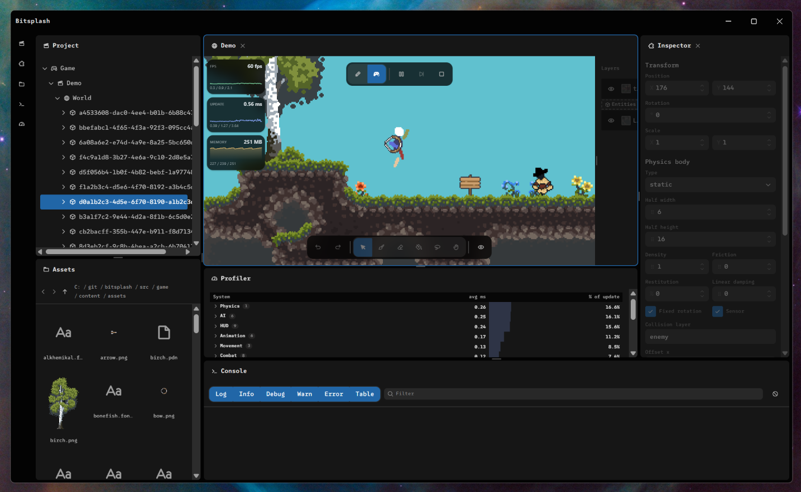

<div align="center">

# Bitsplash



_The Bitsplash editor provides live scene views, entity inspection, scene trees, asset browsing, first-class profiling, debugging console, among other tools._

</div>

## The project

Bitsplash is a 2D game engine and the toolchain around it. It is built from scratch on web technology so a game can run anywhere, and it is aimed at 2D platformers, which is the genre of the game we're developing alongside it. The repo is organized as three layers:

- **Engine:** a reusable 2D game engine with a custom entity-component-system, [Rapier](https://rapier.rs/) physics, and WebGL2 rendering to a canvas.
- **Editor:** a visual authoring tool for scenes, sprites, and prefabs, built on the engine. It runs as an Electron desktop app so it can own the filesystem and take over browser-reserved shortcuts.
- **Game:** the platformer itself (working title Fantasy Platformer), assembled from engine systems and authored content. It runs in any modern browser, and also in Electron, where it gets lower-level control such as unlocking the frame rate.

## Running locally

Bitsplash uses [Bun](https://bun.sh), not npm or node.

```sh
bun install
bun dev       # launches the editor
bun game      # builds and launches the game
```

During development, `bun check` runs lint, format, and typecheck, and `bun test` runs the suite.

## Further reading

- [`AGENTS.md`](AGENTS.md): architecture, layer rules, and conventions
- [`docs/plans/`](docs/plans/): per-system design plans
- [`docs/design/`](docs/design/): game design notes
